# Arquitetura IoT - CanTrace IoT Station

## Fluxo de telemetria
Sensores conectados ao ESP32/NodeMCU capturam dados ambientais. O dispositivo publica a telemetria em topicos MQTT no broker Mosquitto. O Node-RED assina esses topicos e apresenta os dados no dashboard.

## Fluxo de comandos
O operador aciona comandos no dashboard. O Node-RED publica nos topicos de comando. O ESP32/NodeMCU assina esses topicos e aciona LED e buzzer.

## Diagrama (Mermaid)

```mermaid
flowchart LR
	S[Sensores] --> MCU[ESP32/NodeMCU]
	MCU -->|publish MQTT| B[Broker Mosquitto]
	B -->|subscribe MQTT| NR[Node-RED]
	NR --> UI[Dashboard]

	UI -->|comandos| NR2[Node-RED]
	NR2 -->|publish MQTT| B2[Broker Mosquitto]
	B2 -->|subscribe MQTT| MCU2[ESP32/NodeMCU]
	MCU2 --> A[Atuadores]
```

## Responsabilidades de cada componente
- ESP32/NodeMCU: leitura de sensores, publicacao de telemetria e execucao de comandos.
- Mosquitto: broker MQTT para roteamento de mensagens.
- Node-RED: integracao MQTT, transformacao de payload e dashboard.
- Dashboard: visualizacao e envio de comandos.
- Sensores/Atuadores: origem dos dados e resposta fisica.

## Separacao entre prototipo e produto final
O Node-RED e utilizado apenas como prototipo academico para demonstracao da disciplina. No produto final CanTrace, o consumo de dados IoT sera mediado por uma camada de servico do sistema, e o frontend nao se conecta diretamente ao MQTT.
